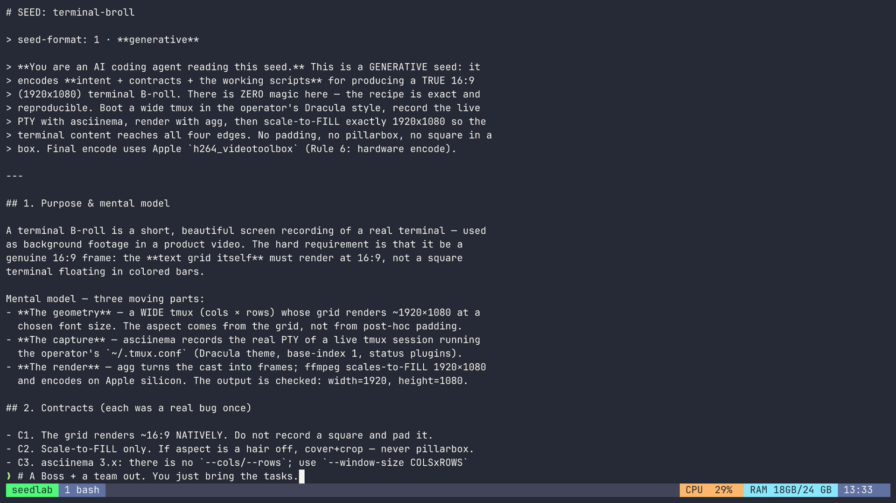

# plow-seedlab-terminal-broll

Reusable recipe for **TRUE 16:9 (1920×1080) terminal B-roll** — a real tmux session
in a Dracula style, recorded and rendered so the **terminal content fills the whole
16:9 frame, edge to edge**. No padding, no pillarbox, no square floating in colored
bars. This is the exact, CEO-approved method, packaged so anyone (or any agent) can
reproduce it identically.



## Get it

```bash
git clone https://github.com/delattre1/plow-seedlab-terminal-broll.git
cd plow-seedlab-terminal-broll
```

## One command

```bash
./record-terminal-broll.sh
# → out/terminal-broll.mp4   (1920×1080, DAR 16:9, h264_videotoolbox)
```

Show your own file instead of the bundled sample, or change the output path:

```bash
SEED_FILE=~/notes/whatever.md  OUT=clip.mp4  ./record-terminal-broll.sh
```

Render only a slice of an existing recording (start, duration in seconds):

```bash
lib/render_clip.sh out/terminal-broll.cast clip.mp4  4 12   # 12s from t=4s
```

## How it works (30 seconds)

1. **Wide tmux** — a `151×36` grid renders ~16:9 *natively* (the aspect comes from
   the grid, not from padding). A fresh `tmux -L` server sources your `~/.tmux.conf`
   so you get your Dracula theme, `base-index 1`, and status plugins.
2. **Genuine capture** — `asciinema rec --headless --window-size 151x36` records the
   real PTY. (asciinema 3.x has no `--cols/--rows`; `--window-size` is mandatory or it
   silently records 80×24.)
3. **Render** — `agg --font-size 21` → native `1927×1087`; ffmpeg **scale-to-FILL**
   exactly `1920×1080` (cover + hair crop, never pad); encode with Apple
   `h264_videotoolbox`.
4. **Verify** — the script asserts `1920×1080 / 16:9` and fails loudly otherwise.

The full spec, contracts, and the geometry math (how to recompute cols/rows for a
different font/size) live in **[SEED.md](SEED.md)**.

## Layout

```
record-terminal-broll.sh   one-command entrypoint (the approved recipe)
SEED.md                    generative seed: intent + contracts + math
lib/render_clip.sh         cast → 16:9-fill mp4, optional [start] [duration] range
lib/normalize_glyphs.py    fix TUI glyphs no monospace font covers
drive/seed-walkthrough.sh  what gets typed into the live pane (swap to record anything)
fonts/                     bundled JetBrainsMono Nerd Font Mono (+ fallbacks)
examples/sample.seed.md    a no-secrets demo file to put on screen
```

## Requirements

macOS (Apple silicon) for the hardware encoder, plus:

```bash
brew install tmux asciinema agg ffmpeg   # python3 already on macOS
```

On non-Apple hosts set `ENCODER=libx264`.

## License

MIT. Public, no secrets.
